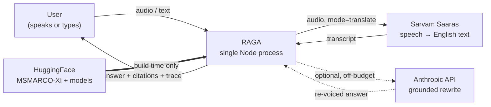
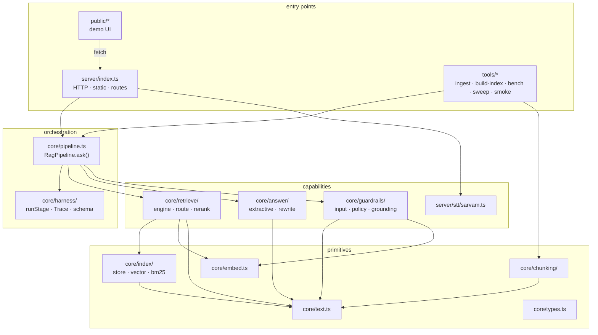
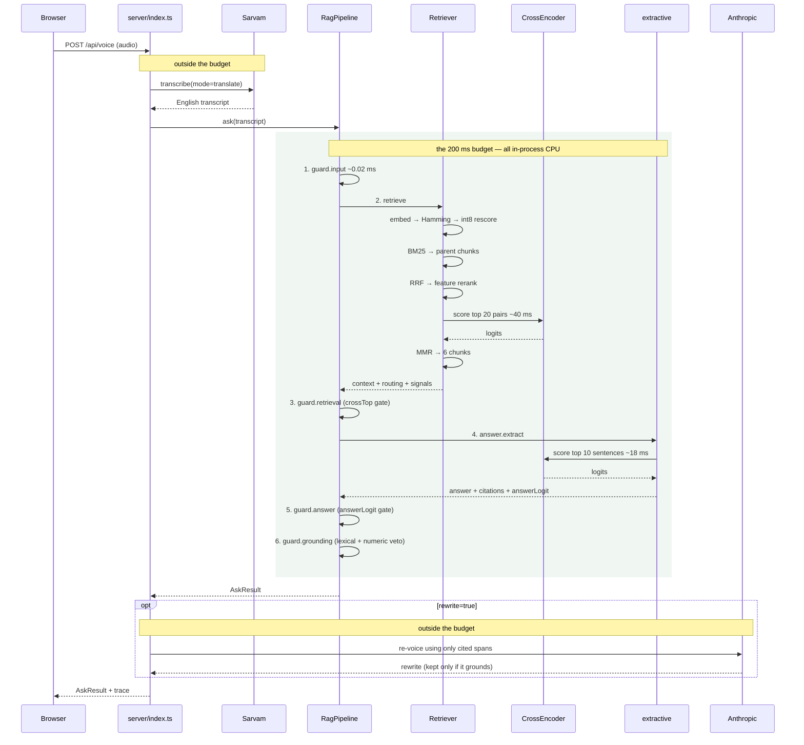

# Architecture

How RAGA is put together: the components, the boundaries between them, what
crosses each boundary, and what happens at runtime.

- [1. System context](#1-system-context)
- [2. Containers and processes](#2-containers-and-processes)
- [3. Module architecture](#3-module-architecture)
- [4. Data flow](#4-data-flow)
- [5. The data model](#5-the-data-model)
- [6. Boot sequence](#6-boot-sequence)
- [7. Cross-cutting concerns](#7-cross-cutting-concerns)
- [8. Deployment topology](#8-deployment-topology)
- [9. Architectural constraints and consequences](#9-architectural-constraints-and-consequences)

---

## 1. System context

Three external systems, and only one of them is on the critical path for a text
question.



| Dependency | When | Required | If it fails |
|---|---|---|---|
| **Sarvam Saaras** | Voice input only | No | Circuit breaker opens; UI degrades to typed input |
| **Anthropic** | `rewrite=true` only | No | Verified extractive answer stands unchanged |
| **HuggingFace** | Ingest and `npm run setup` | Build time | Runtime never touches it — models and index are vendored |

The build-time arrow is solid because it is the one that carries volume: 65.5 MB
of MSMARCO-XI over HTTP range requests, plus ~47 MB of ONNX weights. The runtime
arrows are the thin ones.

---

## 2. Containers and processes

There is exactly one process. That is an architectural decision, not an
omission.

```
┌──────────────────────────────────────────────────────────────────────┐
│  node src/server/index.ts        (Node 24, TypeScript run directly)  │
│                                                                      │
│  ┌────────────────┐   ┌──────────────────────────────────────────┐   │
│  │ node:http      │   │  RagPipeline (module scope, one instance) │   │
│  │ 4 API routes   │──▶│                                           │   │
│  │ + static files │   │   Retriever ── DenseIndex   (33.8 MB)     │   │
│  └────────────────┘   │            ├── Bm25Index    (built @boot) │   │
│         │             │            └── CrossEncoder (ONNX graph)  │   │
│         │             │   passageText[] / passageAlt[] (13.9 MB)  │   │
│         │             │   chunks: Int32Array          (1.6 MB)    │   │
│         ▼             └──────────────────────────────────────────┘   │
│  ┌────────────────┐              │                                   │
│  │ Sarvam client  │              ▼                                   │
│  │ + CircuitBreaker│      onnxruntime-node (CPU, 8-bit)              │
│  └────────────────┘        MiniLM-L6-v2  ·  ms-marco-MiniLM-L-6-v2   │
│                                                                      │
│  measured RSS after warmup ≈ 420 MB                                  │
└──────────────────────────────────────────────────────────────────────┘
```

**Why one process, no vector DB, no framework.** The entire index is 49.4 MB.
A vector database would add a network hop to a 10 ms operation and a second
thing to operate; a web framework would add a dependency tree to serve six
routes. The production dependency count is **two**: `@huggingface/transformers`
and `@anthropic-ai/sdk`. Node 24 executes the TypeScript sources directly, so
there is no build step and no artefact that can drift from the source.

**Scaling model.** CPU-bound and single-threaded at the ONNX layer, so this
scales by adding instances, not threads — each instance holds its own copy of a
49 MB read-only index. `render.yaml` and `fly.toml` both pin an always-on
instance because every published latency number is a warm-process number.

---

## 3. Module architecture

Four layers. Dependencies point strictly downward — `core/` never imports from
`server/` or `tools/`, which is what lets the benchmark harness drive the exact
same code path the server serves.



| Layer | Rule it obeys |
|---|---|
| **primitives** | Pure functions and flat typed arrays. No I/O except `store.ts` reading five files at load. Everything works in character offsets against the passage string — nothing copies text. |
| **capabilities** | One concern each, each independently testable, each returning a typed result rather than throwing for expected outcomes (a guardrail returns a verdict; it does not throw a refusal). |
| **orchestration** | `pipeline.ts` knows the *order* of the stages and nothing about their internals. `harness/` knows how to run a stage and nothing about which stages exist. |
| **entry points** | Adapters. `server/` turns HTTP into `ask()`; `tools/` turns a CLI flag into `ask()`. Neither contains pipeline logic. |

---

## 4. Data flow

### 4.1 The request path



The shaded region is what `trace.pipelineMs` measures. `sttMs` and `llmMs` are
reported as separate fields and never summed into it — see
[PIPELINE.md](PIPELINE.md#what-is-inside-the-budget).

### 4.2 The build path

```
ai4bharat/MSMARCO-XI (55.6 GB, 1 row group, no page index)
        │
        │  HTTP Range requests + parquet page-boundary truncation
        ▼  65.5 MB transferred = 0.118% of the dataset
data/raw/  passages.jsonl (11,904)  queries.jsonl (1,200)  manifest.json
        │
        │  pass 1: split sentences → embed sentences → run 6 strategies
        │          → collapse identical spans (130,162 → 78,342)
        │  pass 2: embed each chunk's metadata-augmented text
        │          → quantize straight into the output buffers
        ▼
data/index/  meta.json · passages.json · chunks.bin · vec_bin.bin · vec_i8.bin
             ─────────────────────────────────────────────────────  49.4 MB
```

Both passes are in [`build-index.ts`](../src/tools/build-index.ts); the byte-window
parquet reader is in [`parquet-window.ts`](../src/tools/parquet-window.ts). Full
account in [INDEXING.md](INDEXING.md).

---

## 5. The data model

Everything downstream of chunking is offsets, not strings.

```
Passage 4711  "A corporation is a company or group of people authorised to act
               as a single entity … It weighs about 4 pounds."
               └── passageText[4711] : string        (the only copy)
               └── passageAlt[4711]  : string        (same passage, Hindi)

ChunkRef 60123 = chunks[60123*5 .. 60123*5+4]
               ┌ passageId    4711
               ├ start          0     ─┐  slice bounds into passageText[4711]
               ├ end          142     ─┘
               ├ strategyMask  0b001101   PASSAGE│SENTENCE_WINDOW│STRUCTURAL
               └ tokenCount    24

vec_bin.bin[60123*48 .. +48]    1 bit  per dim — the coarse search space
vec_i8.bin [60123*384 .. +384]  8 bits per dim — the rescoring space
```

Three consequences fall straight out of that layout:

1. **78,342 chunks cost the text memory of 11,904 passages.** No chunk owns a
   string; `chunkText(id)` is a `slice`.
2. **Strategies that agree store one span with several bits set.** 130,162
   proposals collapse to 78,342 unique spans (39.8%), and the per-strategy
   ablation stays exact because a strategy's recall is measured over every span
   carrying its bit.
3. **Loading the index allocates five buffers and parses one JSON.** No
   per-record objects for 78k chunks, which is what keeps RSS inside a 512 MB
   container.

The vocabulary all of this shares — `STRATEGY`, `QueryType`, `ChunkRef`,
`ScoredChunk`, `RefusalReason`, `AskResult` — is declared once in
[`core/types.ts`](../src/core/types.ts) and imported everywhere else.

### Chunk ordering invariant

Chunks are emitted passage by passage during the build, so each passage owns a
**contiguous** id range. The `Retriever` constructor turns that into CSR offsets
in one scan (`passageChunkOffset`), which is how a BM25 passage hit expands to
its chunks in O(chunks-in-passage) with no map lookups.

---

## 6. Boot sequence

```
1. RagPipeline.load()          read 5 files → LoadedIndex
2. new Retriever(index)          ├─ DenseIndex over the two vector buffers
                                 ├─ Bm25Index built over 11,904 passages
                                 └─ passageChunkOffset CSR scan
3. retriever.strategyStats()   one walk of the 78k chunk table → /api/meta
4. loadExamples()              60 spread-sampled questions from queries.jsonl
5. pipeline.warmup()             ├─ crossEncoder.warm()  builds the ONNX graph
                                 └─ 3 rounds × 2 real questions through ask()
6. server.listen()
```

Step 5 is the one that matters. Both ONNX graphs are built and every stage is
exercised **before the socket opens**, so the first request a visitor makes is
already warm. A cold first request would be the single most misleading number
this project could publish — which is also why both deployment configs forbid
scale-to-zero.

---

## 7. Cross-cutting concerns

Four things cut across every layer. Each is implemented once.

### 7.1 The harness — uniform failure behaviour

Every step that can fail is declared as a `StageDef` and executed by
[`runStage`](../src/core/harness/stage.ts): wall-clock timeout raced against the
work, bounded exponential backoff with jitter, retries spent **only** on errors
the stage marked retryable, a circuit breaker for the network stages, and a
typed fallback as the last resort.

| Stage | Timeout | Retries | Breaker | Fallback |
|---|---|---|---|---|
| `retrieve` | 2 s | 1 | — | (validates that context exists) |
| `stt` | 20 s | 2 | 4 fails / 20 s cooldown | HTTP 502/503 + "type instead" |
| `answer.rewrite` | 20 s | 1 | 3 fails / 30 s cooldown | keep the extractive answer |

The in-process stages (`guard.*`, `answer.extract`) run through `timed` /
`timedAsync` instead — they are pure CPU, so a retry would only repeat a
deterministic result. Details in [HARNESS.md](HARNESS.md).

### 7.2 Trust boundaries — everything is validated

Three kinds of "someone else's JSON" reach this system, and all three go through
the ~120-line validator in [`harness/schema.ts`](../src/core/harness/schema.ts),
which names the exact failing path (`body.topK: expected <= 12`):

```
HTTP request body ──▶ ASK_REQUEST      (server/index.ts)
Sarvam response   ──▶ RESPONSE         (server/stt/sarvam.ts)
LLM structured out──▶ REWRITE_RESPONSE (core/answer/rewrite.ts)
```

A retrying harness is only useful if the retry knows what was wrong, which is
why the validator reports paths rather than booleans.

### 7.3 Tracing — every stage, every response

A `Trace` is created per request and threaded through `ask()` into the retriever.
Each stage records `{name, ms, attempts?, note?}`. `pipelineMs` is the sum of all
stages except `stt`, `answer.rewrite` and the `retrieve.*` sub-stages (excluded
to avoid double-counting inside `retrieve`). The UI renders the result live as a
bar against the 200 ms budget.

### 7.4 Abstention — three gates on one signal family

Refusal is a first-class outcome, not an error. `AskResult.status` is
`ANSWERED | ABSTAINED | REFUSED`, and a refusal still carries the retrieved
context and the signal values the gate compared — the difference between a
system that knows it should not answer and one that merely failed.

```
guard.input      before retrieval   rules       → REFUSED / ABSTAINED
guard.retrieval  after retrieval    crossTop    → OUT_OF_CORPUS / WEAK_RETRIEVAL
guard.answer     after synthesis    answerLogit → NO_ANSWER_IN_CONTEXT
guard.grounding  after synthesis    containment → UNGROUNDED_ANSWER
```

See [GUARDRAILS.md](GUARDRAILS.md) for the thresholds and the measured
separation that justifies each one.

---

## 8. Deployment topology

```
        ┌────────────────────────────────────────────┐
        │  Docker image (node:24-slim)               │
        │    /app/src        TypeScript, run direct  │
        │    /app/models     both ONNX graphs  47 MB │
        │    /app/data/index the index         49 MB │
        │    /app/public     the demo UI             │
        └────────────────────────────────────────────┘
                │                        │
        render.yaml                  fly.toml
        starter, singapore           shared-cpu-2x, 1 GB, bom
        healthCheck /api/health      min_machines_running = 1
```

Debian rather than Alpine because `onnxruntime-node` ships glibc binaries.
Models are fetched **at image build time** (`RUN node src/tools/fetch-model.ts`),
never at boot — a container that reaches out to HuggingFace on its first request
is a container whose startup depends on someone else's uptime.

Secrets are environment-only: `SARVAM_API_KEY` gates voice, `ANTHROPIC_API_KEY`
gates the rewrite, and `/api/meta` advertises which capabilities are actually
live so the UI hides what is not configured.

---

## 9. Architectural constraints and consequences

Each row is a constraint the task or the data imposed, and the structural
decision it forced.

| Constraint | Consequence in the architecture |
|---|---|
| **200 ms for everything through to final output** | The default answer generator is extractive, not generative. No hosted LLM answers in 200 ms, so the LLM is an optional *re-voicing* stage behind the verified answer, reported as `llmMs`. |
| **Every character of the answer must be citable** | Answers are verbatim spans, so the grounding check is a *verification* rather than a hope; the numeric veto exists specifically for the rewrite path where that guarantee is lost. |
| **The dataset is 55.6 GB with one row group** | Ingest could not use any off-the-shelf reader. A byte-window parquet reader is a first-class module, not a script. |
| **MS MARCO passages are ~3 sentences** | One fixed-size split is worst exactly here, so chunking is six strategies over a shared span table rather than one splitter — and the span table exists so that costs 78k vectors instead of 130k. |
| **The corpus is a 0.118% sample** | Most of the web is out of scope, so abstention has to be a designed subsystem with swept thresholds, not an afterthought. |
| **Cross-encoder is 81% of the budget** | Its inputs are capped (512 chars, 20 candidates, 2 per passage) and length-bucketed. Those caps are *architectural* — they are the reason the budget holds. |
| **Speech is Indic and often code-mixed** | Sarvam in `translate` mode, so the transcript arrives already in the index's language and there is no second translation model on the path. |

The honest limitations that follow from these — concurrency behaviour, the weak
"No Answer Present" detection, transcription quality — are listed in
[DESIGN.md §8](DESIGN.md#8-known-limitations) and the root README.
